# crud_front
Please refer to backend repo and connect them both for best output.

Thank you for checking out!
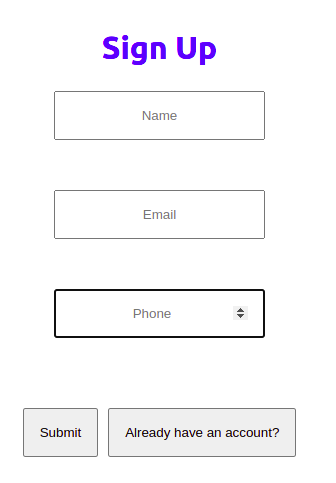
Sign UP

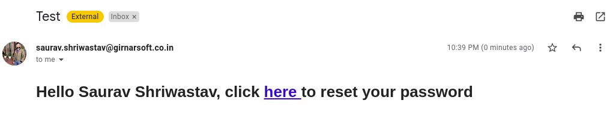
Confirm Email

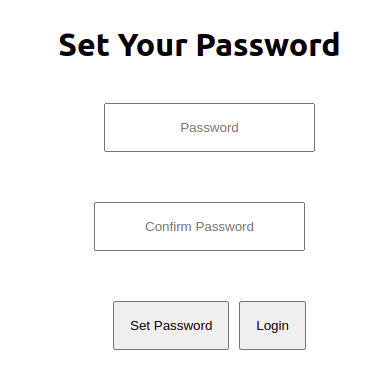
Set Password

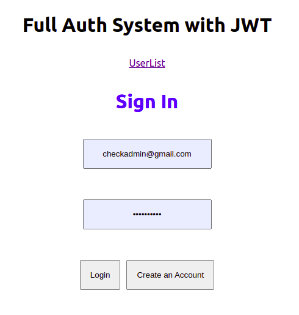
Login

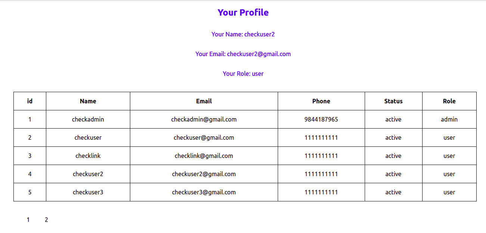
User View

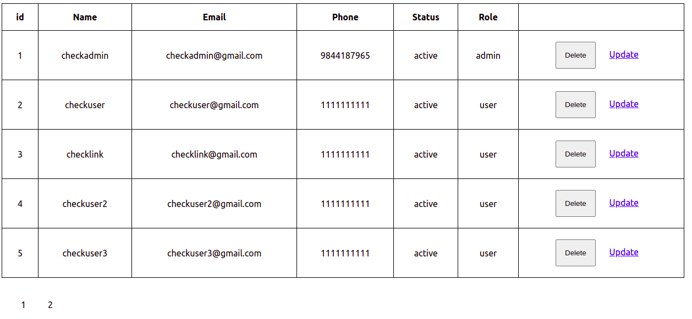
Admin View

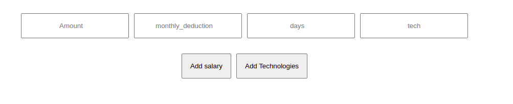
Add More Details

Add More Details

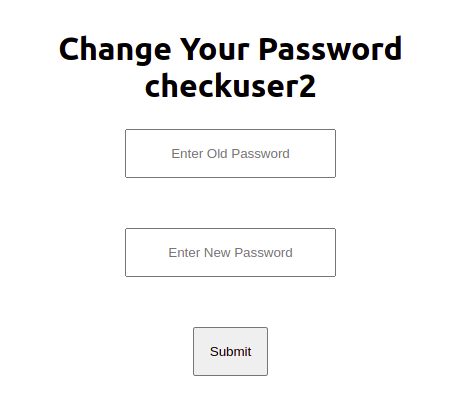
Change Your Password

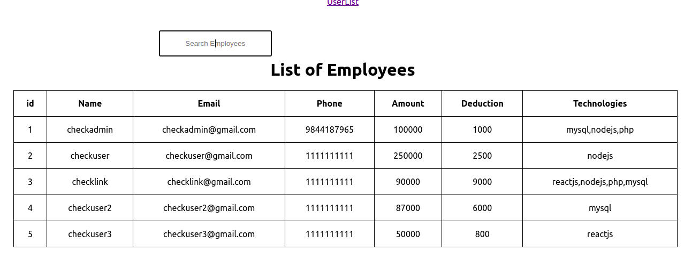
Search View

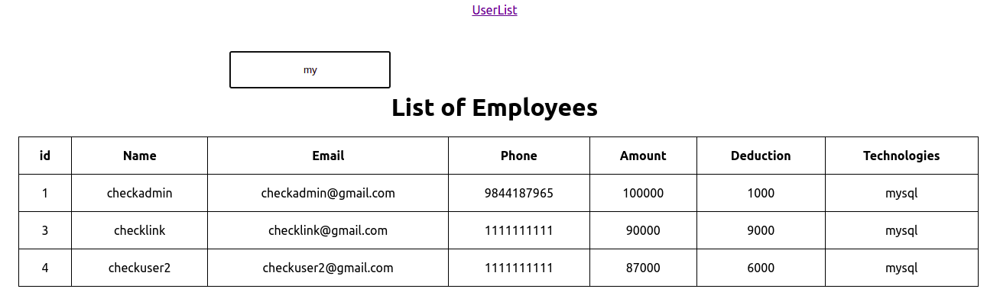
Searching keyword "my" 

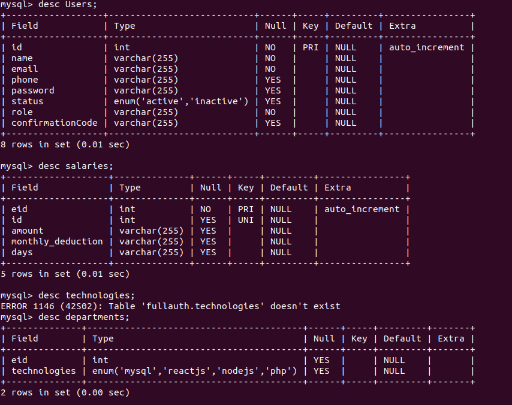
Database Model

